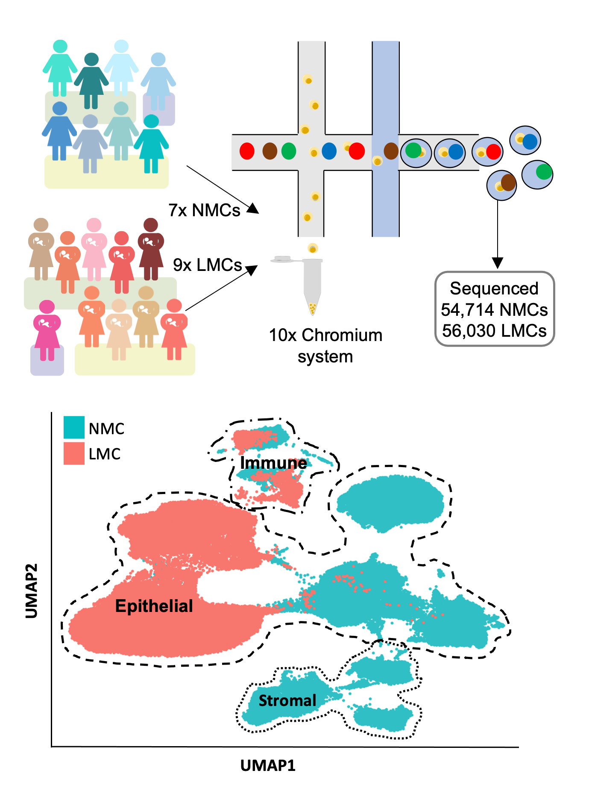

# LactatingMammaryCells

## About
This repository contains all scripts to reproduce the results from the paper "Transcriptional changes in the mammary gland during lactation revealed by single cell sequencing of cells from human milk".

## Overview

## Abstract
Findings from epidemiological studies have shown that breast cancer risk is influenced by parity in an age-dependent manner. However, human mammary tissue remodelling that takes place during pregnancy and lactation remains poorly understood due to the challenge of acquiring samples. We report here single-cell transcriptomic analysis of 110,744 viable breast cells isolated from human milk or non-lactating breast tissue, isolated from nine and seven donors, respectively. We found that human milk largely contains epithelial cells belonging to the luminal lineage and a repertoire of immune cells. Further transcriptomic analysis of the milk cells identified two distinct secretory cell types that shared similarities with luminal progenitors, but no populations comparable to hormone-responsive cells. Taken together, our data offers a comprehensive reference map and a window on the cellular dynamics that occur during human lactation and provides further insights on the interplay between pregnancy, lactation and breast cancer.

## Repository
The repository is structured as follows:

- All scripts are contained in the [src](src/) folder
- Quality control and initial cell filtering was done on individual batches (see [Individual_batches](src/Individual_batches) folder)
- Scripts are organized in analytical scripts that produce e.g. csv outputs and scripts that were used to generate the figures of the paper

## Links
- Interactive [website](http://marionilab.cruk.cam.ac.uk/mammaryGland/) to explore data online
- Data can also be accessed at Array Express: 
Batch 1: ([E-MTAB-9841](http://www.ebi.ac.uk/arrayexpress/experiments/E-MTAB-9841))
Batch 2: ([E-MTAB-10855](http://www.ebi.ac.uk/arrayexpress/experiments/E-MTAB-10855))
Batch 3: ([E-MTAB-10885](http://www.ebi.ac.uk/arrayexpress/experiments/E-MTAB-10885))
- [WTK Lab](https://www.phar.cam.ac.uk/research/Khaled)

## Questions
For questions contact "ajt215@cam.ac.uk"